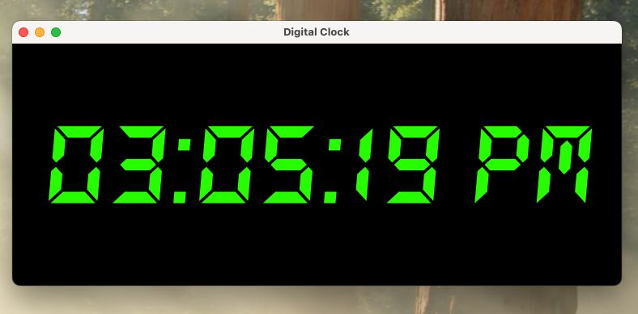
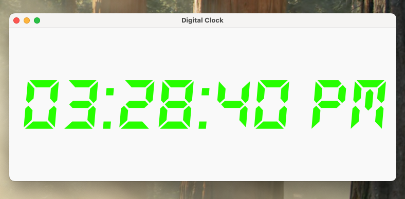

# Python Digital Clock ⏰
## 🖼 App Preview


**Made using PyQt5**

A minimal desktop digital clock built with PyQt5, featuring a custom 7-segment-style font, dynamic layout, 
light and dark mode (based on current time), and robust exception handling. 
This project demonstrates modular GUI programming, file-based logging, and safe resource loading.

---

## 🚀 Features

- **Live digital clock** updating every second
- **Custom digital font** (`DS-DIGIT.TTF`) applied using Qt's font database
- **Exception-safe font loading** with automatic fallback to the system font
- **Auto-generated log files** with detailed error tracebacks (timestamped)
- Clean GUI with:
  - Centered layout
  - HSL color styling
  - Dark background for high contrast

---

## 🗂 Project Structure

```
PythonDigitalClock/
├── main.py              # Entry point – sets up logging and launches the app
├── digitalClock.py      # Contains the DigitalClock widget (UI + logic)
├── logConfig.py         # Handles timestamped log file setup
├── setup.py             # Handles the setup to package the app (unrelated to the app's logic)
├── fonts/
│   └── ds_digital/
│       └── DS-DIGIT.TTF # Custom font file
├── logs/                # Automatically created log files for each run
└── README.md            # You're here :)
```

---

## 🧠 How It Works

### Font Loading
The clock uses a custom font (`DS-DIGIT.TTF`) to mimic a digital display. Font loading is handled through `QFontDatabase`. If the font fails to load (e.g., missing, corrupt, unreadable), the program:

- Logs the error to a **timestamped file** (inside `/logs`)
- Falls back to a **default system font**
- Keeps the application running safely

### Logging
- Logs are saved to `/logs/clock_YYYY-MM-DD_HH-MM-SS.log`
- Only **errors and critical issues** are logged
- Output is sent to both:
  - A file for persistent inspection
  - The console for real-time debugging

---

## 🔧 Requirements

- Python 3.7+
- PyQt5

Install dependencies with:

```bash
pip install PyQt5
```

---

## ▶️ Running the App

Make sure you're in the root folder:

```bash
python main.py
```

A new log file will be created automatically in the `logs/` folder each time you run the app.

---

## 📁 Fonts

The custom font is located at:

```
fonts/ds_digital/DS-DIGIT.TTF
```

You can replace it with any `.ttf` file of your choice by modifying the path inside `load_font()`.

---

## 🛡️ Exception Handling

Exception types handled during font loading:
- `FileNotFoundError` – if the font file is missing
- `IndexError` – if no font families are returned after loading
- `RuntimeError` – raised manually when font registration fails
- `OSError` – if the file is corrupted or locked

These are caught gracefully and logged via Python’s `logging` module.

---
---

## 🍎 Building a macOS `.app` (Standalone Application)

You can turn this project into a native macOS `.app` using [`py2app`](https://py2app.readthedocs.io/en/latest/). Follow the steps below:

### ✅ Recommended Python Version
Use **Python 3.11** — `py2app` is not compatible with Python 3.13+ as of now.

---

### ⚙️ Setup Instructions

```bash
# Install Python 3.11 via Homebrew (if needed)
brew install python@3.11

# Create and activate a virtual environment
python3.11 -m venv venv311
source venv311/bin/activate

# Install dependencies
pip install pyqt5 py2app
```

---

### 🧱 Build the `.app`

```bash
python3 setup.py py2app
```

This will create a standalone app in the `dist/` folder:
```
dist/
└── main.app
```

To run it:
```bash
open dist/main.app
```

To run it from the terminal and see logs:
```bash
./dist/main.app/Contents/MacOS/main
```

---

### 📁 Fonts in App Bundle

The custom font is bundled inside the app at:
```
main.app/Contents/Resources/fonts/ds_digital/DS-DIGIT.TTF
```

The `load_font()` method in the code auto-detects whether the app is running in a bundle and adjusts the font path accordingly.

---

### ⚠️ macOS Gatekeeper Notice

If the app fails to launch due to security restrictions, run:

```bash
xattr -dr com.apple.quarantine dist/main.app
```

This removes the quarantine flags and allows unsigned apps to run.
## 🧑‍💻 Author

Built by @fgatto13.
Cleanly written and modularized to demonstrate PyQt5 best practices.

---

## 🙏 Credits & Acknowledgments

This project is based on a PyQt5 digital clock tutorial originally created by [BroCode](https://www.youtube.com/watch?v=ix9cRaBkVe0&t=17196s).

The original tutorial served as a foundation for building a minimal clock GUI.  
This version expands upon it with:

- Exception-safe font handling
- Robust logging to timestamped files
- Modular project structure (`main.py`, `digitalClock.py`, `logConfig.py`)
- Best practices for maintainability and error traceability

These enhancements aim to demonstrate real-world engineering standards, especially around resilience and observability.
